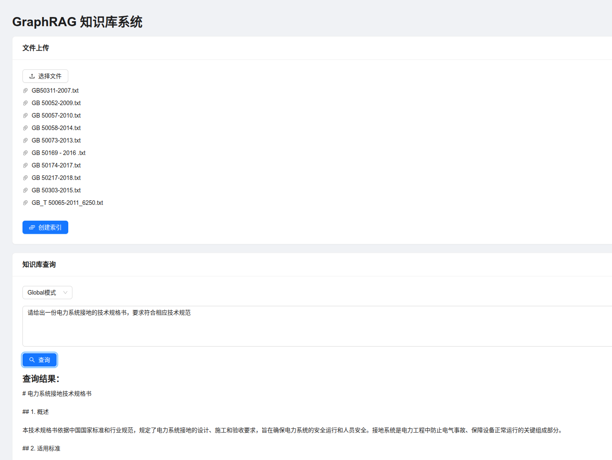

# GraphRAG Web Interface

这是一个基于GraphRAG的知识库系统的Web界面，支持文档上传、索引创建和知识查询功能。

## 功能特点

- 支持多文件上传（.txt格式）
- 支持创建知识库索引
- 提供两种查询模式：Global和Local
- 实时查询响应

## 系统要求

### 后端要求
- Python 3.6+
- Flask
- Flask-CORS

### 前端要求
- Node.js 14+
- npm 或 yarn
- 现代浏览器（支持ES6+）

## 项目结构
```
graphrag/
├── frontend/              # 前端React应用
│   ├── src/              # 源代码
│   │   ├── index.js      # 应用入口点
│   │   ├── App.js        # 主应用组件
│   │   └── App.css       # 样式文件
│   ├── public/           # 静态文件
│   │   └── index.html    # HTML模板
│   └── package.json      # 前端依赖配置
├── server.py             # 后端Flask服务器
├── requirements.txt      # Python依赖
└── ragtest/              # GraphRAG工作目录
    └── input/           # 上传文件存储目录
```

## 安装步骤

1. 克隆仓库：
```bash
git clone https://github.com/Haixin-Gong/graph-rag.git
cd graphrag
```
将 Deepseek 和 GLM 的 API KEY 传入 settings.yaml 和 .envs (可选择)

2. 安装后端依赖：
```bash
pip install -r requirements.txt
```

3. 安装前端依赖：
```bash
cd frontend
npm install
```

## 运行应用

1. 启动后端服务器：
```bash
# 在项目根目录下
python server.py
```
后端服务器将在 http://localhost:5000 运行

2. 启动前端开发服务器：
```bash
# 在frontend目录下
export NODE_OPTIONS=--openssl-legacy-provider
npm start
```
前端应用将在 http://localhost:3000 运行

## 使用指南

### 文件上传
1. 点击"选择文件"按钮
2. 选择一个或多个.txt文件
3. 文件会自动上传到服务器

### 创建索引
1. 确保已经上传了文件
2. 点击"创建索引"按钮
3. 等待索引创建完成

### 知识查询
1. 选择查询模式：
   - Global模式：在整个文档范围内查询
   - Local模式：在相关上下文范围内查询
2. 在输入框中输入您的问题
3. 点击"查询"按钮获取答案

## API文档

### 后端API端点

#### 1. 文件上传
- 端点：`POST /upload`
- 请求：multipart/form-data
- 响应：
```json
{
    "success": true/false,
    "message": "上传状态信息"
}
```

#### 2. 创建索引
- 端点：`POST /index`
- 响应：
```json
{
    "success": true/false,
    "message": "索引创建状态"
}
```

#### 3. 知识查询
- 端点：`POST /query`
- 请求体：
```json
{
    "method": "global/local",
    "query": "查询问题"
}
```
- 响应：
```json
{
    "success": true/false,
    "result": "查询结果",
    "message": "错误信息（如果有）"
}
```

## 常见问题解决

1. 前端启动错误
   - 问题：OpenSSL相关错误
   - 解决：使用 `export NODE_OPTIONS=--openssl-legacy-provider`

2. 后端连接问题
   - 检查后端服务是否运行
   - 确认API地址配置正确
   - 检查CORS设置

3. 文件上传失败
   - 确保文件格式为.txt
   - 检查文件大小是否超限
   - 确保上传目录有写入权限

## 许可证

Following MIT License

## 更新日志

### v1.0.0
- 初始版本发布
- 基本功能实现：文件上传、索引创建、知识查询